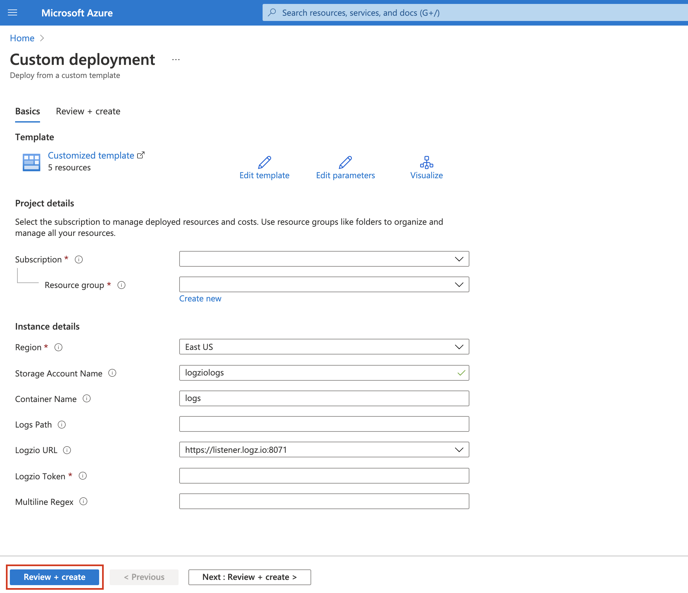

# Ship logs to Logz.io using Azure Blob Trigger

Auto-deployment of azure resources for shipping logs from Azure storage using blob trigger

## Getting Started

There are 2 options for auto-deployment, follow the instructions for the one that is suitable for you:

### Full Auto-Deployment

Will auto-deploy the following resources:

- Storage Account + Container
- App Service Plan - Consumption Plan
- Application Insights
- Logz.io Function App + Logz.io Blob Trigger Function

Press the button to start:

You'll be taken to Azure Custom deployment page. Fill in all the parameters and click **Review + create** button:

