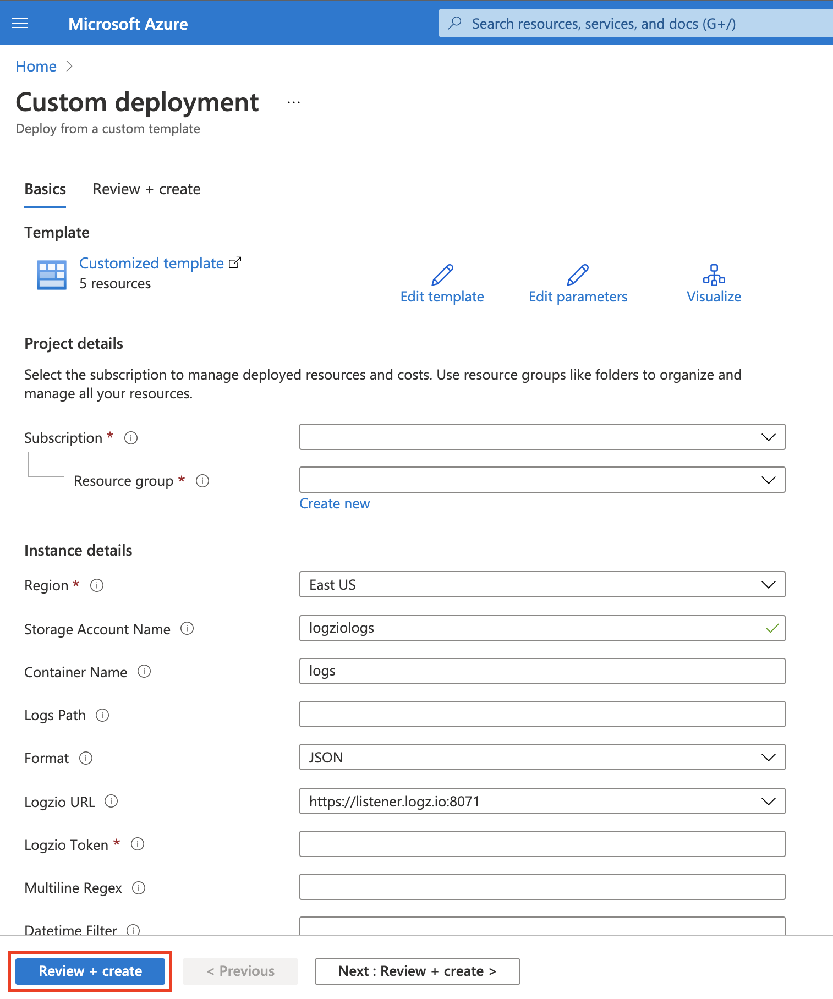
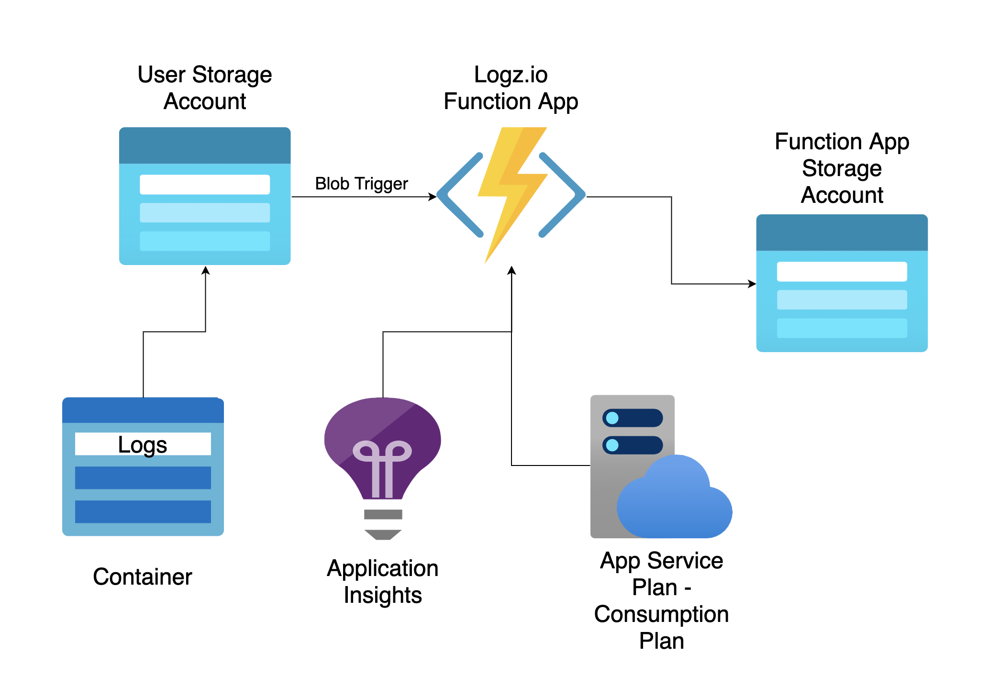

# Ship logs to Logz.io using Azure Blob Trigger

Auto-deployment of Azure resources for shipping logs from Azure storage using blob trigger. 
Each new log in the container path inside the storage account (including sub directories), will trigger the Logz.io function that will ship the file content to Logz.io.

## Getting Started

There are 2 options for auto-deployment. Choose the one that is suitable for you and follow the instructions:

### Full Auto-Deployment

If you don't have storage account (general purpose v2) with container with logs, or you want to create everything from scratch, this auto-deployment is for you. 
Will auto-deploy the following resources:

- Storage Account (general purpose v2) + Container
- App Service Plan - Consumption Plan
- Application Insights
- Logz.io Function App + Logz.io Blob Trigger Function
- Storage Account for Logz.io Function App logs

Press the button to start:

### Logz.io Function Auto-Deployment

If you already have storage account (general purpose v2) with container with logs, this auto-deployment is for you.
Will auto-deploy the following resources:

- App Service Plan - Consumption Plan
- Application Insights
- Logz.io Function App + Logz.io Blob Trigger Function
- Storage Account for Logz.io Function App logs

* When deploying the Logz.io function, logs that were in the container before the deployment will be shipped to Logz.io.
If these logs have already been shipped to Logz.io, we recommend that you empty the container before the deployment.

## Instructions

You'll be taken to Azure Custom deployment page. Fill in all the parameters and click **Review + create** button:

| Parameter | Description |
| --- | --- |
| Storage Account Name | The storage account (general purpose v2) name. |
| Storage Account Resource Name | The resource name that contains the storage account. (Needed only in Logz.io Function Auto-Deployment) | 
| Container Name | The name of the container inside the storage account |
| Logs Path | The path from where blob files will trigger the Logz.io function (including sub directories in that path). Leave empty if you want that every blob file in the container will trigger the Logz.io function. |
| Logzio URL | The Logz.io listener URL fot your region. (For more details, see the regions page: https://docs.logz.io/user-guide/accounts/account-region.html) |
| Logzio Token | Your Logz.io logs token. (Can be retrieved from the Manage Token page.)
| Multiline Regex | The regex that matches the multiline logs in text blob files. Leave empty if you do not use multiline logs in your text blob files. |

On the following screen, press the **create** button:

If everything went well, you should see the following screen. Press **Go to resource group** button to go to your resource group with all the created resources:

## Resources

## Supported Data Types

The Logz.io function supports the following data types:

- Json
- CSV (supported delimiters: ',' ';' '|')
- Text (supports multiline text - MultilineRegex parameter)

* The file name **does not** have to be with these extensions.

## Supported File Formats

The Logz.io function supports the following file formats:

- Gzip

## Searching in Logz.io

All logs that were sent from the function will be under the type `azure_blob_trigger` 
